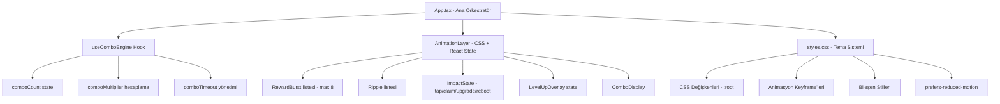

# Tasarım Dokümanı: Game Engagement Overhaul

## Genel Bakış

Bu tasarım, ADN Arena Telegram Mini App'inin görsel ve oyun döngüsü katmanlarını kapsamlı biçimde yeniler. Hedef; renk paletini daha canlı ve doygun hale getirmek, tap etkileşimini görsel olarak güçlendirmek, istemci tarafında bir combo çarpan motoru eklemek ve ödül/başarı geri bildirim sistemini derinleştirmektir.

Tüm değişiklikler `apps/web/src/` altında gerçekleşir. Sunucu tarafı (`apps/api/`) bu kapsamda değiştirilmez; combo çarpanı yalnızca istemci tarafında görsel amaçlı hesaplanır.

---

## Mimari



### Temel Tasarım Kararları

**1. ComboEngine istemci tarafında kalır.**
Sunucuya gönderilen tap isteği mevcut `tapPower` değerini kullanmaya devam eder. Combo çarpanı yalnızca görsel geri bildirim için hesaplanır; ekonomik etki sunucu tarafında değiştirilmez. Bu, anti-cheat sistemini bozmadan oyun hissini iyileştirir.

**2. CSS-first animasyon stratejisi.**
Tüm animasyonlar `transform` ve `opacity` üzerinden çalışır. `width`, `height`, `top`, `left` gibi layout tetikleyen özellikler animasyonlarda kullanılmaz. Bu, Telegram Mini App'in düşük güçlü cihazlarda 60fps hedefini korur.

**3. RewardBurst sınırı.**
Aynı anda ekranda en fazla 8 RewardBurst bulunabilir. Bu sınır aşıldığında en eski etiket kaldırılır. Bellek sızıntısı ve görsel gürültü önlenir.

**4. Tek CSS dosyası.**
Mevcut `apps/web/src/styles.css` dosyası korunur ve genişletilir. Ayrı dosya oluşturulmaz; bu, Telegram Mini App'in bundle boyutunu minimal tutar.

---

## Bileşenler ve Arayüzler

### `useComboEngine` Hook

```typescript
// apps/web/src/hooks/useComboEngine.ts

type ComboState = {
  comboCount: number;
  comboMultiplier: number; // 1.0 | 1.5 | 2.0 | 3.0
  isActive: boolean;
};

type UseComboEngineReturn = ComboState & {
  registerTap: () => void;  // Her tap'te çağrılır
  reset: () => void;        // Manuel sıfırlama
};

// Eşik tablosu
// comboCount >= 20 → x3.0
// comboCount >= 10 → x2.0
// comboCount >= 5  → x1.5
// comboCount < 5   → x1.0
```

Hook, `useRef` ile son tap zamanını saklar ve `setTimeout` ile 1200ms sonra combo'yu sıfırlar. Her yeni tap geldiğinde önceki timeout iptal edilir.

### `LevelUpOverlay` Bileşeni

```typescript
// apps/web/src/components/LevelUpOverlay.tsx

type Props = {
  level: number;
  visible: boolean;
  onDone: () => void;
};
```

1200ms görünür kalır, ardından `onDone` çağrılır. App.tsx'te `gameBus.on('level_up')` ile tetiklenir.

### `ComboDisplay` Bileşeni

```typescript
// apps/web/src/components/ComboDisplay.tsx

type Props = {
  multiplier: number;  // 1.5 | 2.0 | 3.0
  count: number;
  visible: boolean;    // false olduğunda 400ms fade-out
};
```

TapCore'un üst kısmında, `--adn-title-font` ile render edilir.

### `EnergyBar` Güncellemesi

Mevcut `game-progress` ve `game-energy-row` CSS sınıfları güncellenir. Yeni CSS sınıfları:

- `.game-energy-bar` — 16px yükseklik, shimmer ve danger state'leri
- `.game-energy-bar--full` — shimmer animasyonu aktif
- `.game-energy-bar--danger` — kırmızı-turuncu gradient + pulse

### `DockBar` Güncellemesi

Mevcut `.game-dock` ve `.game-dock__button` sınıfları güncellenir. Yeni özellikler:

- Aktif sekme: `linear-gradient(180deg, var(--adn-violet), var(--adn-blue))`
- Aktif ikon: `scale(1.15)` + `box-shadow: 0 0 16px rgba(139, 92, 246, 0.6)`
- Bildirim noktası: `.game-dock__badge` — 8px kırmızı daire

---

## Veri Modelleri

### ComboEngine İç Durumu

```typescript
// useComboEngine hook içinde yönetilir
interface ComboEngineState {
  comboCount: number;          // Ardışık tap sayısı
  lastTapTime: number;         // Date.now() - ms cinsinden
  timeoutRef: ReturnType<typeof setTimeout> | null;
}

// Çarpan hesaplama (saf fonksiyon)
function getMultiplier(count: number): number {
  if (count >= 20) return 3.0;
  if (count >= 10) return 2.0;
  if (count >= 5)  return 1.5;
  return 1.0;
}
```

### RewardBurst Genişletmesi

Mevcut `RewardBurst` tipi korunur, `tone` alanı genişletilir:

```typescript
type RewardBurst = {
  id: number;
  label: string;
  x: number;
  y: number;
  tone: 'gold' | 'cyan' | 'pink' | 'violet';
  // gold   → ADN ödülleri
  // cyan   → XP ödülleri
  // pink   → kritik vuruşlar
  // violet → boost aktivasyonları
};
```

### EnergyBar Görsel Durumu

```typescript
// App.tsx içinde hesaplanır, CSS sınıfı olarak uygulanır
type EnergyBarVariant = 'normal' | 'full' | 'danger';

function getEnergyVariant(percent: number): EnergyBarVariant {
  if (percent >= 100) return 'full';
  if (percent < 20)   return 'danger';
  return 'normal';
}
```

### Streak Görsel Durumu

```typescript
// Streak 7 ve katlarında milestone animasyonu tetiklenir
function isStreakMilestone(streak: number): boolean {
  return streak > 0 && streak % 7 === 0;
}

function isStreakHighlighted(streak: number): boolean {
  return streak >= 7;
}
```

---

## Doğruluk Özellikleri

*Bir özellik (property), sistemin tüm geçerli çalışmalarında doğru olması gereken bir karakteristik veya davranıştır — temelde sistemin ne yapması gerektiğine dair biçimsel bir ifadedir. Özellikler, insan tarafından okunabilir spesifikasyonlar ile makine tarafından doğrulanabilir doğruluk garantileri arasındaki köprüyü oluşturur.*

### Özellik 1: Ripple koordinat tutarlılığı

*Herhangi bir* (x, y) koordinat çifti için, tap olayı tetiklendiğinde `rewardBursts` listesine eklenen elemanın koordinatları, tap olayının koordinatlarıyla eşleşmelidir.

**Doğrular: Gereksinim 2.2, 2.3**

### Özellik 2: Combo çarpan monotonluğu

*Herhangi bir* combo sayısı için, `getMultiplier(n)` fonksiyonu her zaman `getMultiplier(n-1)` değerine eşit veya daha büyük bir değer döndürmelidir (çarpan hiçbir zaman azalmaz).

**Doğrular: Gereksinim 3.2, 3.3, 3.4**

### Özellik 3: Combo zaman penceresi invariantı

*Herhangi bir* zaman aralığı değeri için: iki tap arasındaki süre 1200ms'nin altındaysa combo sayacı artmalı, 1200ms'yi geçmişse combo sayacı sıfırlanmalıdır.

**Doğrular: Gereksinim 3.1, 3.5**

### Özellik 4: RewardBurst liste sınırı

*Herhangi bir* sayıda ardışık burst ekleme işlemi sonrasında, `rewardBursts` listesinin uzunluğu hiçbir zaman 8'i geçmemelidir.

**Doğrular: Gereksinim 8.3**

### Özellik 5: EnergyBar durum sınıflandırması

*Herhangi bir* enerji yüzdesi değeri için, `getEnergyVariant` fonksiyonu tutarlı biçimde: `%100`'de `'full'`, `%20` altında `'danger'`, diğer durumlarda `'normal'` döndürmelidir.

**Doğrular: Gereksinim 4.3, 4.4**

### Özellik 6: Streak vurgulama eşiği

*Herhangi bir* streak değeri için, `isStreakHighlighted` fonksiyonu 7 ve üzeri değerlerde `true`, altında `false` döndürmelidir; ve `isStreakMilestone` fonksiyonu yalnızca 7'nin pozitif katlarında `true` döndürmelidir.

**Doğrular: Gereksinim 7.1, 7.2**

### Özellik 7: Level up overlay tetiklenme koşulu

*Herhangi bir* önceki seviye ve yeni seviye çifti için, yeni seviye önceki seviyeden büyükse LEVEL UP overlay'i gösterilmeli; eşit veya küçükse gösterilmemelidir.

**Doğrular: Gereksinim 6.3**

---

## Hata Yönetimi

### Animasyon Hataları

- CSS animasyonları `try/catch` gerektirmez; tarayıcı desteklemediği özellikleri sessizce yok sayar.
- `will-change: transform` yalnızca animasyon süresince uygulanır; animasyon bitiminde `will-change: auto` ile sıfırlanır.

### ComboEngine Hataları

- `setTimeout` referansı `useRef` ile saklanır; bileşen unmount olduğunda `clearTimeout` çağrılır (bellek sızıntısı önlenir).
- Combo sayacı negatife düşemez; `Math.max(0, ...)` ile korunur.

### RewardBurst Sınır Aşımı

```typescript
function pushBurst(label: string, x: number, y: number, tone: RewardBurst['tone']) {
  const id = Date.now() + Math.random();
  setRewardBursts(current => {
    const next = [...current, { id, label, x, y, tone }];
    // Sınır aşıldığında en eski eleman kaldırılır
    return next.length > 8 ? next.slice(next.length - 8) : next;
  });
  // ...
}
```

### Düşük Performans Tespiti

`requestAnimationFrame` döngüsü ile FPS ölçülür. 60fps altına düşüldüğünde `data-low-perf="true"` attribute'u `<body>`'ye eklenir ve CSS bu attribute'u kullanarak parçacık efektlerini devre dışı bırakır:

```css
body[data-low-perf="true"] .game-tapper__halo,
body[data-low-perf="true"] .game-core-particle {
  display: none;
}
```

### Hata Mesajı Görselleştirme

Başarısız işlemler `game-status-banner--error` sınıfı ile kırmızı-turuncu tonunda gösterilir; sol kenarda 3px kırmızı çizgi eklenir.

---

## Test Stratejisi

### Birim Testleri

Belirli örnekler ve sınır koşulları için:

- `getMultiplier(0)` → `1.0`
- `getMultiplier(5)` → `1.5`
- `getMultiplier(10)` → `2.0`
- `getMultiplier(20)` → `3.0`
- `getEnergyVariant(100)` → `'full'`
- `getEnergyVariant(19)` → `'danger'`
- `getEnergyVariant(50)` → `'normal'`
- `isStreakHighlighted(6)` → `false`
- `isStreakHighlighted(7)` → `true`
- `isStreakMilestone(7)` → `true`
- `isStreakMilestone(8)` → `false`

### Özellik Tabanlı Testler (Property-Based Testing)

**Kütüphane:** `fast-check` (TypeScript/JavaScript için)

Her özellik testi minimum 100 iterasyon çalıştırılır.

**Özellik 1 — Ripple koordinat tutarlılığı:**
```typescript
// Feature: game-engagement-overhaul, Property 1: Ripple koordinat tutarlılığı
fc.assert(fc.property(
  fc.float({ min: 0, max: 500 }),
  fc.float({ min: 0, max: 800 }),
  (x, y) => {
    const bursts: RewardBurst[] = [];
    pushBurstTo(bursts, '+10', x, y, 'gold');
    return bursts[0].x === x && bursts[0].y === y;
  }
), { numRuns: 100 });
```

**Özellik 2 — Combo çarpan monotonluğu:**
```typescript
// Feature: game-engagement-overhaul, Property 2: Combo çarpan monotonluğu
fc.assert(fc.property(
  fc.integer({ min: 1, max: 100 }),
  (n) => getMultiplier(n) >= getMultiplier(n - 1)
), { numRuns: 100 });
```

**Özellik 3 — Combo zaman penceresi invariantı:**
```typescript
// Feature: game-engagement-overhaul, Property 3: Combo zaman penceresi invariantı
fc.assert(fc.property(
  fc.integer({ min: 0, max: 2400 }),
  fc.integer({ min: 1, max: 50 }),
  (intervalMs, initialCount) => {
    const engine = createComboEngine(initialCount);
    engine.registerTap(intervalMs);
    if (intervalMs < 1200) {
      return engine.comboCount === initialCount + 1;
    } else {
      return engine.comboCount === 1; // sıfırlanıp yeni tap eklendi
    }
  }
), { numRuns: 100 });
```

**Özellik 4 — RewardBurst liste sınırı:**
```typescript
// Feature: game-engagement-overhaul, Property 4: RewardBurst liste sınırı
fc.assert(fc.property(
  fc.integer({ min: 1, max: 50 }),
  (burstCount) => {
    let bursts: RewardBurst[] = [];
    for (let i = 0; i < burstCount; i++) {
      bursts = addBurstWithLimit(bursts, makeBurst(i));
    }
    return bursts.length <= 8;
  }
), { numRuns: 100 });
```

**Özellik 5 — EnergyBar durum sınıflandırması:**
```typescript
// Feature: game-engagement-overhaul, Property 5: EnergyBar durum sınıflandırması
fc.assert(fc.property(
  fc.float({ min: 0, max: 100 }),
  (percent) => {
    const variant = getEnergyVariant(percent);
    if (percent >= 100) return variant === 'full';
    if (percent < 20)   return variant === 'danger';
    return variant === 'normal';
  }
), { numRuns: 100 });
```

**Özellik 6 — Streak vurgulama eşiği:**
```typescript
// Feature: game-engagement-overhaul, Property 6: Streak vurgulama eşiği
fc.assert(fc.property(
  fc.integer({ min: 0, max: 365 }),
  (streak) => {
    const highlighted = isStreakHighlighted(streak);
    const milestone = isStreakMilestone(streak);
    const correctHighlight = streak >= 7 ? highlighted : !highlighted;
    const correctMilestone = (streak > 0 && streak % 7 === 0) ? milestone : !milestone;
    return correctHighlight && correctMilestone;
  }
), { numRuns: 100 });
```

**Özellik 7 — Level up overlay tetiklenme koşulu:**
```typescript
// Feature: game-engagement-overhaul, Property 7: Level up overlay tetiklenme koşulu
fc.assert(fc.property(
  fc.integer({ min: 1, max: 99 }),
  fc.integer({ min: 1, max: 100 }),
  (prevLevel, newLevel) => {
    const shouldShow = shouldShowLevelUp(prevLevel, newLevel);
    return newLevel > prevLevel ? shouldShow : !shouldShow;
  }
), { numRuns: 100 });
```

### Entegrasyon Testleri

- Tap akışı: `handleTap` → API çağrısı → state güncelleme → animasyon tetikleme zinciri
- Combo + RewardBurst entegrasyonu: combo aktifken burst etiketinin çarpanı yansıtıp yansıtmadığı
- DockBar bildirim noktası: `daily.canClaim === true` iken tasks sekmesinde badge görünürlüğü

### Smoke Testleri

- CSS değişkenlerinin beklenen değerlere sahip olduğu
- `prefers-reduced-motion` medya sorgusunun CSS'de tanımlı olduğu
- ComboEngine'in sunucuya gönderilen payload'ı değiştirmediği
- EnergyBar'ın beklenen CSS özelliklerine sahip olduğu
